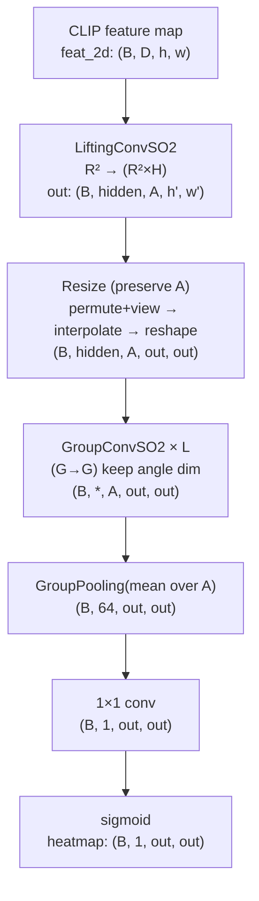
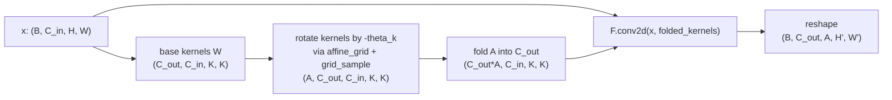
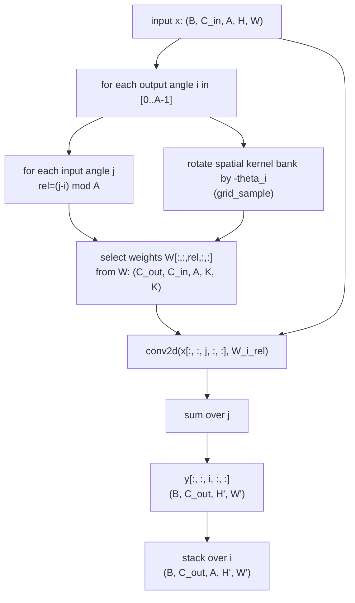

# GCNN SO(2)（取樣近似）Layer Architecture Visualization

這份文件提供 **SO(2) 取樣近似**（`LiftingConvSO2` / `GroupConvSO2`）在本 repo 的可視化架構圖，重點是：
- **角度維度 A** 如何被建立、保留、再 pooling 回平面
- `GroupConvSO2` 的 **twist‑shift（相對角度 rel）** 與 **kernel rotation（用 `grid_sample`）**

對應實作：
- `src/models/blocks/so2_layers.py`
  - `LiftingConvSO2`
  - `GroupConvSO2`
- `src/models/clip_heatmap_model.py`
  - `ClipHeatmapHead` 的 `decoder.kind="gcnn"` 且 `mode="so2"` 路徑

---

## PNG diagram

---

## 1) Macro view：ClipHeatmapHead（SO2 decoder path）

### Shapes（最重要）
- **Lifting**：`(B, C_in, H, W) -> (B, C_out, A, H', W')`
- **SO2 GroupConv**：`(B, C_in, A, H, W) -> (B, C_out, A, H', W')`
- **Pooling**：`(B, C, A, H, W) -> (B, C, H, W)`

---

## 2) LiftingConvSO2：kernel rotation + one-shot conv2d

`LiftingConvSO2` 的核心是：先用 `grid_sample` 把 kernel 旋轉成 A 份，再把角度摺進 output channels，一次 `conv2d` 算完。

---

## 3) GroupConvSO2（G→G）：twist‑shift + rotation conditioned on output angle

這層保留角度維度（A bins），並做 **output angle i** 上的 left‑regular action：
- **相對角度 index**：`rel = (j - i) mod A`
- **空間旋轉**：由 \(g^{-1}\) 決定，即 kernel 旋轉 `-theta_i`
- **累加**：對 input angle `j` 做 sum（因此目前是 **O(A²)**）

---

## 4) Practical notes（這張圖想提醒的事情）

- **A 是 fidelity/成本的開關**：A 越大越接近 “continuous rotation”，但 compute 近似線性（lifting）/平方（group conv）。
- **為什麼 decoder 用 SO2 可行**：這個 repo 沒改 ViT backbone，先在 head 做對稱性補正是務實折衷。
- **`grid_sample` 的 CUDA 相容性**：本 repo 已在 `_rotate_kernels_grid_sample` 做 `fp32 + contiguous + cuDNN fallback`，避免 `CUDNN_STATUS_NOT_SUPPORTED`。

